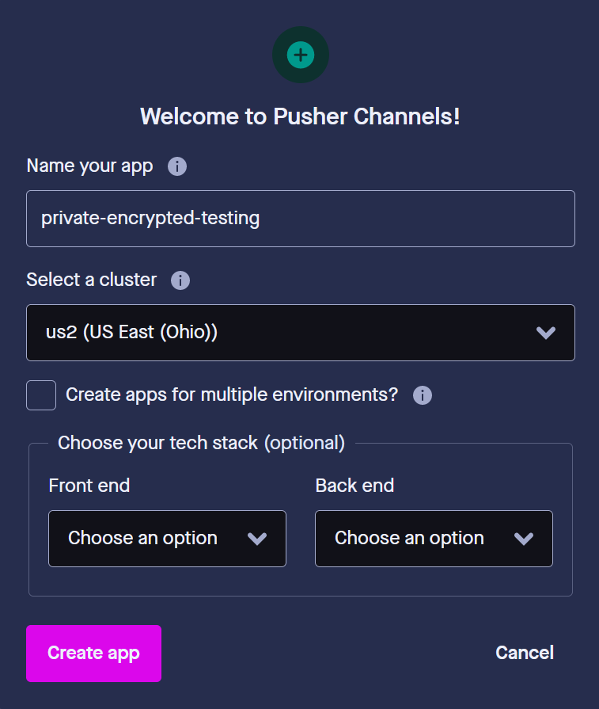
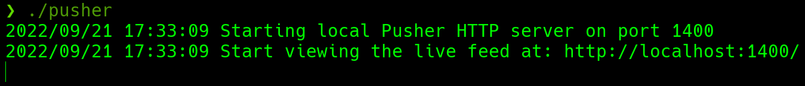
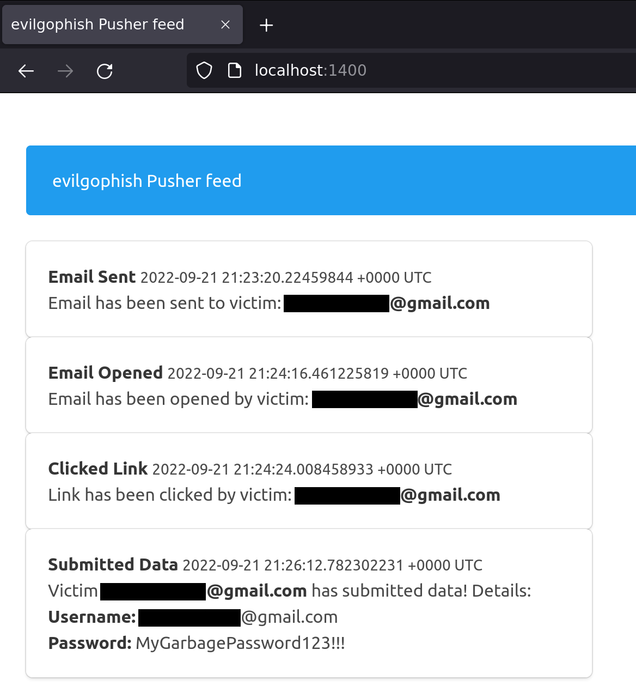

# Table of Contents

- [evilgophish](#evilgophish)
  * [Credits](#credits)
  * [Prerequisites](#prerequisites)
  * [Disclaimer](#disclaimer)
  * [Why?](#why)
  * [Background](#background)
  * [Infrastructure Layout](#infrastructure-layout)
  * [setup.sh](#setupsh)
  * [replace_rid.sh](#replace_ridsh)
  * [Email Campaign Setup](#email-campaign-setup)
  * [SMS Campaign Setup](#sms-campaign-setup)
  * [Pusher Setup](#pusher-setup)
  * [Ensuring Email Opened Tracking](#ensuring-email-opened-tracking)
  * [**Important Notes**](#important-notes)
  * [Phishlets Surprise](#phishlets-surprise)
  * [A Word About Phishlets](#a-word-about-phishlets)
  * [Changes To evilginx2](#changes-to-evilginx2)
  * [Changes to GoPhish](#changes-to-gophish)
  * [Changelog](#changelog)
  * [Limitations](#limitations)
  * [Issues and Support](#issues-and-support)
  * [Future Goals](#future-goals)
  * [Contributing](#contributing)

# evilgophish

Combination of [evilginx2](https://github.com/kgretzky/evilginx2) and [GoPhish](https://github.com/gophish/gophish).

## Credits

Before I begin, I would like to say that I am in no way bashing [Kuba Gretzky](https://github.com/kgretzky) and his work. I thank him personally for releasing [evilginx2](https://github.com/kgretzky/evilginx2) to the public. In fact, without his work this work would not exist. I must also thank [Jordan Wright](https://github.com/jordan-wright) for developing/maintaining the incredible [GoPhish](https://github.com/gophish/gophish) toolkit. The last thank you I must make is to [Fotios Liatsis](https://twitter.com/_wizard32?lang=en) and [Outpost24](https://outpost24.com/) for sharing their solution to combine these two frameworks.

## Prerequisites

You should have a fundamental understanding of how to use `GoPhish`, `evilginx2`, and `Apache2`.

## Disclaimer

I shall not be responsible or liable for any misuse or illegitimate use of this software. This software is only to be used in authorized penetration testing or red team engagements where the operator(s) has(ve) been given explicit written permission to carry out social engineering. 

## Why?

As a penetration tester or red teamer, you may have heard of `evilginx2` as a proxy man-in-the-middle framework capable of bypassing `two-factor/multi-factor authentication`. This is enticing to us to say the least, but when trying to use it for social engineering engagements, there are some issues off the bat. I will highlight the two main problems that have been addressed with this project, although some other bugs have been fixed in this version which I will highlight later.

1. Lack of tracking - `evilginx2` does not provide unique tracking statistics per victim (e.g. opened email, clicked link, etc.), this is problematic for clients who want/need/pay for these statistics when signing up for a social engineering engagement.
2. Session overwriting with NAT and proxying - `evilginx2` bases a lot of logic off of remote IP address and will whitelist an IP for 10 minutes after the victim triggers a lure path. `evilginx2` will then skip creating a new session for the IP address if it triggers the lure path again (if still in the 10 minute window). This presents issues for us if our victims are behind a firewall all sharing the same public IP address, as the same session within `evilginx2` will continue to overwrite with multiple victim's data, leading to missed and lost data. This also presents an issue for our proxy setup, since `localhost` is the only IP address requesting `evilginx2`.

## Background

This project is inspired by this [blog](https://outpost24.com/blog/Better-proxy-than-story) and I encourage you to read it before getting started to get an understanding of the background (this project no longer utilizes the `Apache` log method to provide tracking between the two, rather a database that is logged to by both frameworks). In this setup, `GoPhish` is used to send emails, track opened emails, and provide a dashboard for `evilginx2` campaign statistics, but it is not used for any landing pages. Your phishing links sent from `GoPhish` will point to an `evilginx2` lure path and `evilginx2` will be used for landing pages. This provides the ability to still bypass `2FA/MFA` with `evilginx2`, without losing those precious stats. Realtime campaign event notifications have been provided with [Pusher end-to-end encrypted channels](https://pusher.com/docs/channels/using_channels/encrypted-channels/) and full usable `JSON` strings containing tokens/cookies from `evilginx2` are displayed directly in the `GoPhish` GUI:


## Infrastructure Layout

- `evilginx2` will listen locally on port `8443`
- `GoPhish` will listen locally on port `8080`
- `Apache2` will listen on port `443` externally and proxy to either local `GoPhish/evilginx2` depending on the subdomain name requested
  - Requests will be filtered at `Apache2` layer based on redirect rules and IP blacklist configuration
    - `404` functionality for unauthorized requests is still baked into `GoPhish` if a request hits the `GoPhish` server
    - Redirect functionality for unauthorized requests is still baked into `evilginx2` if a request hits the `evilginx2` server

## setup.sh

Assuming you have read the [blog](https://outpost24.com/blog/Better-proxy-than-story) and understand how the setup works, `setup.sh` has been provided to automate the needed configurations for you. Once this script is run and you've fed it the right values, you should be ready to get started. Below is the setup help (note that certificate setup is based on `letsencrypt` filenames):

```
Usage:
./setup <root domain> <evilginx2 subdomain(s)> <evilginx2 root domain bool> <gophish subdomain(s)> <gophish root domain bool> <redirect url> <Pusher messages bool> <rid replacement>
 - root domain                     - the root domain to be used for the campaign
 - evilginx2 subdomains            - a space separated list of evilginx2 subdomains, can be one if only one
 - evilginx2 root domain bool      - true or false to proxy root domain to evilginx2
 - gophish subdomains              - a space separated list of gophish subdomains, can be one if only one
 - gophish root domain bool        - true or false to proxy root domain to gophish
 - redirect url                    - URL to redirect unauthorized Apache requests
 - Pusher messages bool            - true or false to setup Pusher messages to an encrypted channel
 - rid replacement                 - replace the gophish default "rid" in phishing URLs with this value
Example:
  ./setup.sh example.com login false "download www" false https://redirect.com/ true user_id
```

Redirect rules have been included to keep unwanted visitors from visiting the phishing server as well as an IP blacklist. The blacklist contains IP addresses/blocks owned by ProofPoint, Microsoft, TrendMicro, etc. Redirect rules will redirect known *"bad"* remote hostnames as well as User-Agent strings. 

## replace_rid.sh

In case you ran `setup.sh` once and already replaced the default `RId` value throughout the project, `replace_rid.sh` was created to replace the `RId` value again.

```
Usage:
./replace_rid <previous rid> <new rid>
 - previous rid      - the previous rid value that was replaced
 - new rid           - the new rid value to replace the previous
Example:
  ./replace_rid.sh user_id client_id
```

## Email Campaign Setup

Once `setup.sh` is run, the next steps are: 

1. Start `GoPhish` and configure email template (see note below about email opened tracking), email sending profile, and groups
2. Start `evilginx2` and configure phishlet and lure
3. Ensure `Apache2` server is started
4. Launch campaign from `GoPhish` and make the landing URL your lure path for `evilginx2` phishlet
5. **PROFIT**

## SMS Campaign Setup

An entire reworking of `GoPhish` was performed in order to provide `SMS` campaign support with `Twilio`. Your new `evilgophish` dashboard will look like below:


Once you have run `setup.sh`, the next steps are:

1. Configure `SMS` message template. You will use `Text` only when creating a `SMS` message template, and you should not include a tracking link as it will appear in the `SMS` message. Leave `Envelope Sender` and `Subject` blank like below:


2. Configure `SMS Sending Profile`. Enter your phone number from `Twilio`, `Account SID`, `Auth Token`, and delay in between messages into the `SMS Sending Profiles` page:


3. Import groups. The `CSV` template values have been kept the same for compatibility, so keep the `CSV` column names the same and place your target phone numbers into the `Email` column. Note that `Twilio` accepts the following phone number formats, so they must be in one of these three:


4. Start `evilginx2` and configure phishlet and lure
5. Ensure `Apache2` server is started[]
6. Launch campaign from `GoPhish` and make the landing URL your lure path for `evilginx2` phishlet
7. **PROFIT**

## Pusher Setup

`Microsoft Teams` messages to a channel have been removed. This was due to security reasons and the fact that if someone's `Microsoft` account gets owned, client data is at risk of being compromised. With that being said, I plan to always keep the posting of campaign events *and* submitted passwords into a live feed as a feature of this tool. Realtime campaign event notifications will now be handled by [Pusher end-to-end encrypted channels](https://pusher.com/docs/channels/using_channels/encrypted-channels/). Not even `Pusher` is capable of decrypting the contents of these requests, as operators will set their own encryption key for their own local instance of a `Pusher` feed server I have created. Before data goes out to `Pusher`, it will be encrypted by the local `Pusher` server with this key (read the linked blog for full information) and a string of ciphertext is ultimately what is sent containing the payload data. The encryption key of the local `Pusher` server is never shared with `Pusher`. You might also like to hear that you have a `200k` message limit per day with a `FREE` account! To get setup:

1. Create a new channel in `Pusher`, the channel **MUST** be prefixed with `private-encrypted-`. For example:



2. Select `true` for `Pusher messages bool` when running `setup.sh`. Input your `app_id`, `key`, `secret`, `cluster`, channel name, and server encryption key into `setup.sh` when prompted.
3. `cd` into the `pusher` directory and start the server with `./pusher`. For example:



4. You can begin viewing the live feed at: `http://localhost:1400/`. The feed dashboard will look like below:



**IMPORTANT NOTES**

- The live feed page hooks the channel for events with `JavaScript` and you **DO NOT** need to refresh the page. If you refresh the page, you will **LOSE** all events up to that point.

## Ensuring Email Opened Tracking

You **MUST** include your own image tag that points at the `GoPhish` server with the tracking URL scheme. This is also explained/shown in the [blog](https://outpost24.com/blog/Better-proxy-than-story). For example, if your `GoPhish` subdomain is `download.example.org`, your `evilginx2` lure path is `https://login.example.org/login`, and your `RId` value is `client_id`, you would include the following tag in your email `.html` which will provide email opened tracking in `GoPhish`:

``

## Phishlets Surprise

Included in the `evilginx2/phishlets` folder are three custom phishlets not included in [evilginx2](https://github.com/kgretzky/evilginx2). 

1. `o3652` - modified/updated version of the original `o365` (stolen from [Optiv blog](https://www.optiv.com/insights/source-zero/blog/spear-phishing-modern-platforms))
2. `google` - updated from previous examples online
3. `knowbe4` - custom (don't have access to an account for testing auth URL, works for single-factor campaigns, have not fully tested MFA)

## A Word About Phishlets

I feel like the world has been lacking some good phishlet examples lately. It would be great if this repository could be a central repository for the latest phishlets. Send me your phishlets at `fin3ss3g0d@pm.me` for a chance to end up in `evilginx2/phishlets`. If you provide quality work, I will create a `Phishlets Hall of Fame` and you will be added to it.

## Changes To evilginx2

1. All IP whitelisting functionality removed, new proxy session is established for every new visitor that triggers a lure path regardless of remote IP
2. Fixed issue with phishlets not extracting credentials from `JSON` requests
3. Further *"bad"* headers have been removed from responses
4. Added logic to check if `mime` type was failed to be retrieved from responses
5. All `X` headers relating to `evilginx2` have been removed throughout the code (to remove IOCs)

## Changes to GoPhish

1. All `X` headers relating to `GoPhish` have been removed throughout the code (to remove IOCs)
2. Custom 404 page functionality, place a `.html` file named `404.html` in `templates` folder (example has been provided)
3. Default `rid` string in phishing URLs is chosen by the operator in `setup.sh`
4. Transparency endpoint and messages completely removed
5. Added `SMS` Campaign Support

## Changelog 

See the `CHANGELOG.md` file for changes made since the initial release.

## Limitations 

- All events will only be submitted once into `GoPhish`

## Issues and Support

I am taking the same stance as [Kuba Gretzky](https://github.com/kgretzky) and will not help creating phishlets. There are plenty of examples of working phishlets and for you to create your own, if you open an issue for a phishlet it will be closed. I will also not consider issues with your `Apache2`, `DNS`, or certificate setup as legitimate issues and they will be closed. Please read the included [blog](https://outpost24.com/blog/Better-proxy-than-story) for how to get setup properly. However, if you encounter a legitimate failure/error with the program, I will take the issue seriously.

## Future Goals

- Additions to IP blacklist and redirect rules
- Add more phishlets

## Contributing

I would like to see this project improve and grow over time. If you have improvement ideas, new redirect rules, new IP addresses/blocks to blacklist, phishlets, or suggestions, please email me at: `fin3ss3g0d@pm.me` or open a pull request.