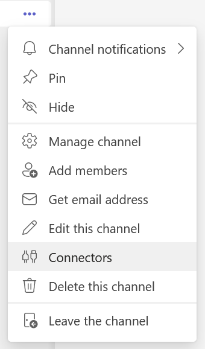
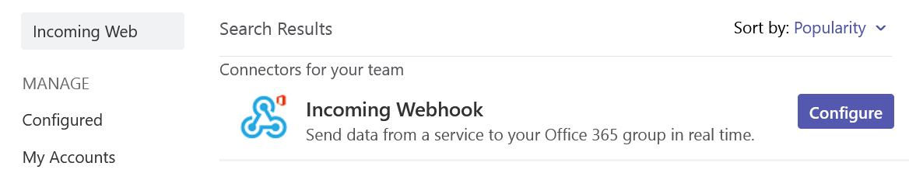
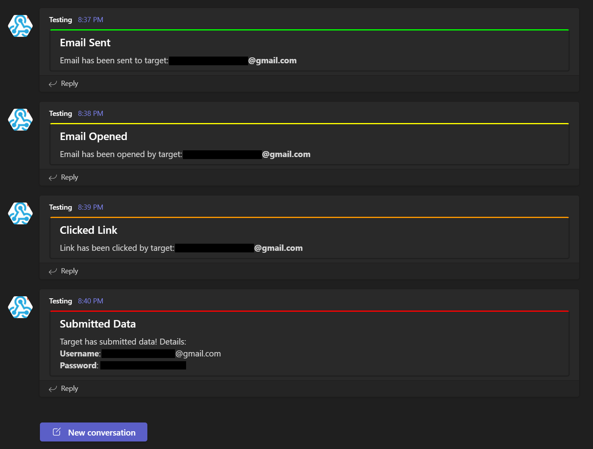

# evilgophish

Combination of [evilginx2](https://github.com/kgretzky/evilginx2) and [GoPhish](https://github.com/gophish/gophish).

## Credits

Before I begin, I would like to say that I am in no way bashing [Kuba Gretzky](https://github.com/kgretzky) and his work. I thank him personally for releasing [evilginx2](https://github.com/kgretzky/evilginx2) to the public. In fact, without his work this work would not exist. I must also thank [Jordan Wright](https://github.com/jordan-wright) for developing/maintaining the incredible [GoPhish](https://github.com/gophish/gophish) toolkit. The last thank you I must make is to [Fotios Liatsis](https://twitter.com/_wizard32?lang=en) and [Outpost24](https://outpost24.com/) for sharing their solution to combine these two frameworks.

## Prerequisites

You should have a fundamental understanding of how to use `GoPhish`, `evilginx2`, and `Apache2`.

## Disclaimer

I shall not be responsible or liable for any misuse or illegitimate use of this software. This software is only to be used in authorized penetration testing or red team engagements where the operator(s) has(ve) been given explicit written permission to carry out social engineering. 

## Why?

As a penetration tester or red teamer, you may have heard of `evilginx2` as a proxy man-in-the-middle framework capable of bypassing `two-factor/multi-factor authentication`. This is enticing to us to say the least, but when trying to use it for social engineering engagements, there are some issues off the bat. I will highlight the two main problems that have been addressed with this project, although some other bugs have been fixed in this version which I will highlight later.

1. Lack of tracking - `evilginx2` does not provide unique tracking statistics per victim (e.g. opened email, clicked link, etc.), this is problematic for clients who want/need/pay for these statistics when signing up for a social engineering engagement.
2. Session overwriting with NAT and proxying - `evilginx2` bases a lot of logic off of remote IP address and will whitelist an IP for 10 minutes after the victim triggers a lure path. `evilginx2` will then skip creating a new session for the IP address if it triggers the lure path again (if still in the 10 minute window). This presents issues for us if our victims are behind a firewall all sharing the same public IP address, as the same session within `evilginx2` will continue to overwrite with multiple victim's data, leading to missed and lost data. This also presents an issue for our proxy setup, since `localhost` is the only IP address requesting `evilginx2`.

## Background

This project is based on this [blog](https://outpost24.com/blog/Better-proxy-than-story) and I encourage you to read it before getting started. In this setup, `GoPhish` is used to send emails, track opened emails, and provide a dashboard for `evilginx2` campaign statistics, but it is not used for any landing pages. To provide tracking between the two, the function resposible for providing campaign results inside `GoPhish` has been modified to instead get clicked link event details and submitted data event details from logs related to `evilginx2`. Your phishing links sent from `GoPhish` will point to an `evilginx2` lure path and `evilginx2` will be used for landing pages. This provides the ability to still bypass `2FA/MFA` with `evilginx2`, without losing those precious stats. The operator will also be informed of a submitted data event in realtime. This should ensure the operator won't run out of time to use captured cookies, or at least be informed as soon as possible. The operator will still need to bounce over to the `evilginx2` terminal to fetch the full `JSON` string of captured tokens/cookies.

## Infrastructure Layout

- `evilginx2` will listen locally on port `8443`
- `GoPhish` will listen locally on port `8080`
- `Apache2` will listen on port `443` externally and proxy to either local `GoPhish/evilginx2` depending on the subdomain name requested. `Apache2` access log file is created for both `GoPhish/evilginx2` servers
  - Requests will be filtered at `Apache2` layer based on redirect rules and IP blacklist configuration
    - `404` functionality for unauthorized requests is still baked into `GoPhish` if a request hits the `GoPhish` server
    - Redirect functionality for unauthorized requests is still baked into `evilginx2` if a request hits the `evilginx2` server

## Getting Setup

Assuming you have read the [blog](https://outpost24.com/blog/Better-proxy-than-story) and understand how the setup works, `setup.sh` has been provided to automate the needed configurations for you. Once this script is run and you've fed it the right values, you should be ready to get started. Below is the setup help (note that certificate setup is based on `letsencrypt` filenames):

```
Usage:
./setup <root domain> <evilginx2 subdomain(s)> <evilginx2 root domain bool> <gophish subdomain(s)> <gophish root domain bool> <redirect url> <Teams messages bool> 
 - root domain                     - the root domain to be used for the campaign
 - evilginx2 subdomains            - a space separated list of evilginx2 subdomains, can be one if only one
 - evilginx2 root domain bool      - true or false to proxy root domain to evilginx2
 - gophish subdomains              - a space separated list of gophish subdomains, can be one if only one
 - gophish root domain bool        - true or false to proxy root domain to gophish
 - redirect url                    - URL to redirect unauthorized Apache requests
 - Teams messages bool             - true or false to setup Microsoft Teams messages
Example:
  ./setup.sh example.com login false "download www" false https://redirect.com/ true
```

Redirect rules have been included to keep unwanted visitors from visiting the phishing server as well as an IP blacklist. The blacklist contains IP addresses/blocks owned by ProofPoint, Microsoft, TrendMicro, etc. Redirect rules will redirect known *"bad"* remote hostnames as well as User-Agent strings. 

Once the setup script is run, the next steps are: 

1. Make sure the `Apache2` log file for `evilginx2` exists before starting `GoPhish` (starting `Apache2` will automatically do this)
2. Start `GoPhish` and configure email template (see note below about email opened tracking), email sending profile, fake landing page, and groups
3. Start `evilginx2` and configure phishlet and lure
4. Ensure `Apache2` server is started
5. Launch campaign from `GoPhish` and make the landing URL your lure path for `evilginx2` phishlet
6. **PROFIT**

## Microsoft Teams Setup

This feature will send campaign events as messages to a `Microsoft Teams` channel. This setup is optional and you do not have to receive campaign events via `Microsoft Teams`. If you *would* like to, this setup will guide you.

1. Create a new channel for the campaign
2. Within the web version of `Microsoft Teams` (I experienced a bug with the Desktop version), select the three dots next to the channel and click on `Connectors`:



3. Within this menu, search for `Incoming Webhook`, you should see the following:



4. Give the webhook a name, copy the `URL` and **DON'T LOSE IT**
5. When running `setup.sh`, set `Teams messages bool` to `true` and paste the webhook URL into the script when prompted
6. Setup complete! You will now receive `Microsoft Teams` messages to a channel notifying you of events for your campaigns, you will see the messages start to come through like below:



## Ensuring Email Opened Tracking

You **CANNOT** use the default `Add Tracking Image` button when creating your email template. You **MUST** include your own image tag that points at the `GoPhish` server with the tracking URL scheme. This is also explained/shown in the [blog](https://outpost24.com/blog/Better-proxy-than-story). For example, if your `GoPhish` subdomain is `download.example.org`, and your `evilginx2` lure path is `https://login.example.org/login`, you would include the following tag in your email `.html` which will provide email opened tracking in `GoPhish`:

``

## **Important Notes**

You **MUST** make sure `Apache2` is logging to the file defined in `gophish/config.json` for the `evilginx2` server, the default path is `/var/log/apache2/access_evilginx2.log` unless you change it. For example, if `Apache2` is logging to `/var/log/apache2/access_evilginx2.log.1` and you have `/var/log/apache2/access_evilginx2.log` defined in `gophish/config.json`, you will lose tracking statistics.

## Phishlets Surprise

Included in the `evilginx2/phishlets` folder are three custom phishlets not included in [evilginx2](https://github.com/kgretzky/evilginx2). 

1. `O3652` - modified/updated version of the original `o365` (stolen from [Optiv blog](https://www.optiv.com/insights/source-zero/blog/spear-phishing-modern-platforms))
2. `google` - updated from previous examples online
3. `knowbe4` - custom (don't have access to an account for testing auth URL, works for single-factor campaigns, have not fully tested MFA)

## A Word About Phishlets

I feel like the world has been lacking some good phishlet examples lately. It would be great if this repository could be a central repository for the latest phishlets. Send me your phishlets at `fin3ss3g0d@pm.me` for a chance to end up in `evilginx2/phishlets`. If you provide quality work, I will create a `Phishlets Hall of Fame` and you will be added to it.

## Changes To evilginx2

1. All IP whitelisting functionality removed, new proxy session is established for every new visitor that triggers a lure path regardless of remote IP
2. Custom credential logging on submitted passwords to `~/.evilginx/creds.json`
3. Fixed issue with phishlets not extracting credentials from `JSON` requests
4. Further *"bad"* headers have been removed from responses
5. Added logic to check if `mime` type was failed to be retrieved from responses
6. All `X` headers relating to `evilginx2` have been removed throughout the code (to remove IOCs)

## Changes to GoPhish

1. Custom logic inserted into `GetCampaignResults` function that handles `evilginx2` tracking from Apache2 access log
2. Custom logging of events to `JSON` format in `HandleEvent` functions
3. Additional config parameter added for Apache2 log path
4. All `X` headers relating to `GoPhish` have been removed throughout the code (to remove IOCs)
5. Default server name has been changed to `IGNORE`
6. Custom 404 page functionality, place a `.html` file named `404.html` in `templates` folder (example has been provided)
7. `rid=` is now `client_id=` in phishing URLs
8. Transparency endpoint and messages completely removed

## Changelog 

See the `CHANGELOG.md` file for changes made since the initial release.

## Limitations 

- All events will only be submitted once into `GoPhish`

## Issues and Support

I am taking the same stance as [Kuba Gretzky](https://github.com/kgretzky) and will not help creating phishlets. There are plenty of examples of working phishlets and for you to create your own, if you open an issue for a phishlet it will be closed. I will also not consider issues with your `Apache2`, `DNS`, or certificate setup as legitimate issues and they will be closed. Please read the included [blog](https://outpost24.com/blog/Better-proxy-than-story) for how to get setup properly. However, if you encounter a legitimate failure/error with the program, I will take the issue seriously.

## Future Goals

- Additions to IP blacklist and redirect rules
- Add more phishlets
- Add SMS campaign support with `Twilio`

## Contributing

I would like to see this project improve and grow over time. If you have improvement ideas, new redirect rules, new IP addresses/blocks to blacklist, phishlets, or suggestions, please email me at: `fin3ss3g0d@pm.me`.